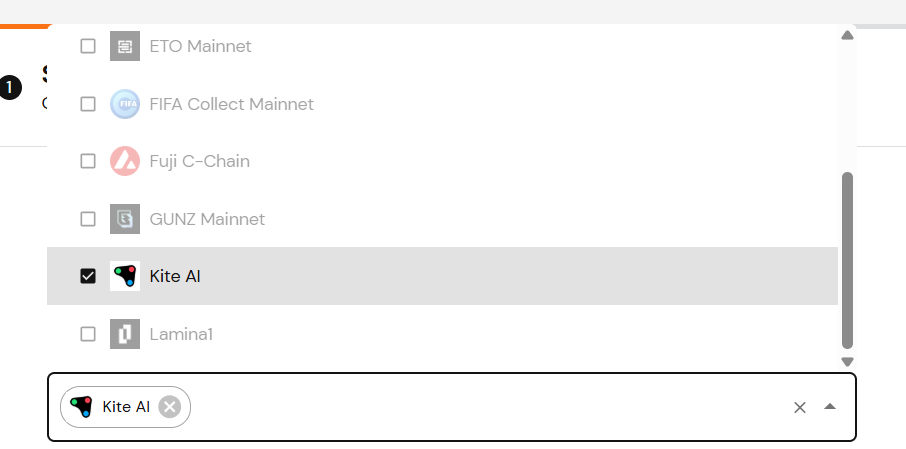

# AgentPayGuard：AI Agent 智能支付系统

**项目描述**：AgentPayGuard 是一个面向 AI Agent 的链上支付权限与风控系统，让 AI Agent 在执行链上稳定币支付时，具备可验证身份、可编程权限、可审计记录、可阻断异常的最小闭环。系统支持自然语言支付请求解析、智能风险评估、AI增强策略和端到端的链上执行工作流。

本仓库提供一个**可复现的 AI Agent 支付系统**，用于 Kite Payment Track：

- **🤖 AI Agent 核心**：支持自然语言支付请求解析和智能风险评估
- **demo:ai-agent**：通过自然语言指令执行支付，支持AI意图解析和风险评估
- **demo:pay**：通过"策略校验 → 稳定币支付（ERC-20 转账）"跑通一笔链上支付（测试网）
- **demo:reject**：故意触发策略（白名单/限额）并拒绝
- **demo:freeze**：验证链上多签冻结风控机制

> 说明：为了避免误转账，默认不发链上交易。你需要显式设置 `EXECUTE_ONCHAIN=1` 才会真的发送。

参赛链接：https://github.com/CasualHackathon/SPARK-AI-Hackathon
---

## 文档导航

| 文档 | 用途 |
|------|------|
| [for_judge.md](docs/for_judge.md) | 📋 **评委评审用** - 赛道要求对照表 + 证据链接 |
| **使用指南** |
| [AI_AGENT_GUIDE.md](docs/guides/AI_AGENT_GUIDE.md) | 🤖 **AI Agent 开发指南**（自然语言解析 + 风险评估 + API参考） |
| [TESTING_GUIDE.md](docs/guides/TESTING_GUIDE.md) | 🧪 Role B 测试与演讲指南（5 个场景 + 演讲脚本） |
| [ROLE_A_GUIDE.md](docs/guides/ROLE_A_GUIDE.md) | 🔗 多签部署指南（Gnosis Safe + TokenGuard） |
| [ROLE_C_GUIDE.md](docs/guides/ROLE_C_GUIDE.md) | 🎨 **前端开发指南**（Web UI + 可视化 + 科技感设计） |
| [ROLE_D_GUIDE.md](docs/guides/ROLE_D_GUIDE.md) | 🎥 PPT 与视频制作指南（支持 Role B 演讲） |
| [FRONTEND_DESIGN_REFERENCE.md](docs/guides/FRONTEND_DESIGN_REFERENCE.md) | 🌈 **Web3 前端设计参考**（黑客松风格分析 + 配色/动画建议） |
| **参考文档** |
| [ARCHITECTURE.md](docs/reference/ARCHITECTURE.md) | 🏗️ 系统架构与设计决策 |
| [allocation.md](docs/reference/allocation.md) | 👥 角色分工与交付物清单 |
| [PM_AND_ROLE_B_CONSOLIDATED.md](docs/internal/PM_AND_ROLE_B_CONSOLIDATED.md) | ⚡ PM / Role B 规整文档（检查清单、命令、测试、A→B 交付）|
| [resources/](docs/resources/) | 📚 **原始资源**（赛道规则、官方链接等） |
| **内部管理** |
| [FINAL_DELIVERY_CHECKLIST.md](docs/internal/FINAL_DELIVERY_CHECKLIST.md) | ✅ 最终交付清单（角色 A/B/C/D） |
| [AGENT_WORKLOG.md](docs/internal/AGENT_WORKLOG.md) | 📝 工作日志（Phase 摘要） |
| [PM_AND_ROLE_B_QUICKREF.md](docs/internal/PM_AND_ROLE_B_QUICKREF.md) | 📋 PM / 角色 B 快速参考（检查清单 + 文档入口） |
| [.clinerules](.clinerules) | 📋 Agent 工作约束 + 安全政策（16 条规则、.env 保护） |

---

## 环境要求

- Node.js >= 18（建议 20+）
- pnpm
- （可选）OpenAI API Key（用于AI意图解析和风险评估）

---

## 子模块（前端）

本仓库包含 **frontend** 子模块（Web UI，独立仓库）。新成员克隆主仓后必须初始化子模块，否则 `frontend/` 目录会是空的。

### 克隆主仓后初始化子模块

```bash
git clone <主仓 URL>
cd AgentPayGuard
git submodule update --init --recursive
```

执行后 `frontend/` 下会有前端代码，可进入 `frontend/` 使用 `npm i` 和 `npm run dev` 单独运行前端。

### 更新子模块到远程最新

在主仓根目录执行：

```bash
git submodule update --remote frontend
```

若要在子模块内修改并推送到前端仓库：

1. 进入子模块：`cd frontend`
2. 正常修改、提交并推送到子模块仓库：`git add .` → `git commit -m "..."` → `git push`
3. 回到主仓根目录：`cd ..`
4. 提交新的 submodule 指针：`git add frontend` → `git commit -m "chore: update frontend submodule"` → `git push`

### 主仓 + 子模块都在新分支修改（不污染 main）

**目标**：主仓和 frontend 子模块都在各自的 feature 分支上修改，不直接改 main，且都能 push 到远端。

**步骤**：

```bash
# 1. 主仓：切到新分支（或创建）
cd AgentPayGuard
git checkout -b feature/your-feature   # 若已有分支则 checkout 即可

# 2. 子模块：切到新分支
cd frontend
git checkout -b feature/your-feature   # 子模块也建同名或对应分支
# 修改 frontend 代码...
git add .
git commit -m "feat: xxx"
git push origin feature/your-feature   # 先 push 子模块到远端

# 3. 主仓：记录新的子模块指针并 push
cd ..
git add frontend
git commit -m "chore: update frontend submodule to feature/your-feature"
git push origin feature/your-feature    # push 主仓到远端
```

**要点**：
- 主仓和子模块**各自**在 feature 分支上工作，互不污染 main
- 子模块先 push，主仓再提交 submodule 指针并 push
- 主仓记录的 submodule 指针指向子模块的**具体 commit**，与子模块所在分支无关
- 若子模块仓库无对应分支权限，可 fork 后改 `.gitmodules` 的 `url` 指向你的 fork

**一次性检查**：
```bash
# 主仓当前分支
git branch --show-current

# 子模块当前分支
cd frontend && git branch --show-current && cd ..
```

---

## 快速开始

### 1) 安装依赖

```bash
pnpm i
```

### 2) 配置环境变量

复制 `.env.example` 为 `.env`，填好以下关键项：

- `PRIVATE_KEY`：测试网私钥（只用于测试）
- `RPC_URL`：默认已填 Kite Testnet RPC：`https://rpc-testnet.gokite.ai/`
- `SETTLEMENT_TOKEN_ADDRESS`：Kite 测试网稳定币（或结算 token）合约地址（从官方文档获取）
- `RECIPIENT`：收款地址
- （可选）`OPENAI_API_KEY`：OpenAI API密钥，用于AI意图解析和风险评估

**可选：Chainlink env-enc 加密敏感变量**

若希望将 `PRIVATE_KEY` 等敏感项加密存储（避免明文写入 `.env`），可使用 [@chainlink/env-enc](https://www.npmjs.com/package/@chainlink/env-enc)：

1. 本会话设置密码：`npx env-enc set-pw`
2. 写入变量：`npx env-enc set`（可填 PRIVATE_KEY 等；与 `.env` 同名变量会被 `.env.enc` 覆盖）
3. 启动前在同一终端已 `set-pw` 时，会优先使用 `.env.enc` 解密后的变量
4. 查看/删除：`npx env-enc view` | `npx env-enc remove VAR_NAME` | `npx env-enc remove-all`

> 项目已集成 env-enc，存在 `.env.enc` 且当前会话已设置密码时，会自动解密并覆盖 `process.env`。

### 3) 运行 AI Agent 演示（自然语言接口）

```bash
# 使用自然语言指令执行支付
pnpm demo:ai-agent "Pay 50 USDC to 0xd2d45ef2f2ddaffc8c8bc03cedc4f55fb9e97e2b for server hosting"

# 如果没有OPENAI_API_KEY，系统会自动使用回退解析器
```

### 4) 运行传统演示（默认 dry-run）

```bash
pnpm demo:pay
pnpm demo:reject
pnpm demo:freeze
```

### 5) 真正发送链上交易（测试网）

把 `.env` 里的 `EXECUTE_ONCHAIN=1` 打开，然后再次运行：

```bash
pnpm demo:pay
# 或使用AI Agent
pnpm demo:ai-agent "Pay 10 USDC to 0xd2d45ef2f2ddaffc8c8bc03cedc4f55fb9e97e2b"
```

输出里会打印 tx hash（把它填到 `for_judge.md` 的占位里）。

### 测试准备（真实发送前必读）

在设置 `EXECUTE_ONCHAIN=1` 做真实链上测试前，请确保钱包有足够测试资产：

| 资产 | 用途 | 建议准备量 |
|------|------|------------|
| **KITE（原生代币）** | 支付 gas | 每笔 EOA 转账约 0.01～0.05 KITE；建议先领一次 faucet（约 0.5 KITE），可支撑多笔测试 |
| **USDT/USDC（稳定币）** | 实际转出金额 | 默认每笔 `AMOUNT=0.001`；做 N 笔测试至少准备 N×0.001（可调大 `.env` 中 `AMOUNT`） |

**获取测试币**：

- **KITE**：打开 [Kite 测试网 Faucet](https://faucet.gokite.ai/)，连接钱包后领取（每地址约 24 小时一次，约 0.5 KITE）。
- **USDT/USDC**：测试网稳定币需从官方文档或社区获取测试网水龙头/转账方式；合约地址填 `.env` 中的 `SETTLEMENT_TOKEN_ADDRESS`。

**单次测试最低消耗**：约 0.01～0.05 KITE（gas）+ 你设置的 `AMOUNT`（默认 0.001 USDT/USDC）。

**低余额测试（约 1 USDT + 0.3 KITE）**：  
可用小额配置（AMOUNT=0.001、MAX_AMOUNT=0.1、DAILY_LIMIT=0.002）配合**干跑**覆盖大部分风控；真实发链仅 1～2 笔验证日限额即可。各风控与冻结场景均支持**前端可测**（PAY 页 + GET /api/policy、GET /api/freeze）。详见 [TESTING_GUIDE - 低余额测试](docs/guides/TESTING_GUIDE.md#低余额测试1-usdt--03-kite) 与 [前端可测风控场景](docs/guides/TESTING_GUIDE.md#前端可测风控场景web-ui)。

### 前端 + API 联调（通过 Web UI 发起支付）

1. **主仓**：在项目根目录启动 API 服务（使用 `.env` 配置）
   ```bash
   # 方式 1：使用 pnpm（注意：pnpm 可能缓冲输出，看不到启动日志）
   pnpm server
   
   # 方式 2：直接运行（推荐，可以看到实时输出）
   API_PORT=3456 npx tsx src/server.ts
   ```
   默认监听 `http://localhost:3456`，提供 `GET /api/health`、`GET /api/policy`、`POST /api/pay`。

2. **前端**：进入子模块并启动开发服务器
   ```bash
   cd frontend && npm i && npm run dev
   ```
   开发环境下 `/api` 会代理到主仓 API（3456），打开首页 → **PAY**，填写收款地址、金额，选择 EOA/AA，勾选「真实发链上交易」后提交即可；成功会返回 txHash 与 Kite 浏览器链接。

3. **环境**：主仓 `.env` 可设 `API_PORT=3456`、`CORS_ORIGIN=*`（或前端地址）；前端生产环境可设 `VITE_API_URL` 指向部署的 API 地址。

---

## AI Agent 功能特性

### 🤖 自然语言支付解析
- 从自然语言指令中提取收款地址、金额、币种、支付目的
- 示例：`"Pay 100 USDC to 0x... for server hosting"`

### 🧠 智能风险评估
- AI评估支付风险（0-100分数，低/中/高风险等级）
- 基于支付目的、金额、历史模式的风险分析
- 提供风险理由和改进建议

### 🔒 AI增强策略
- 传统规则（白名单、限额） + AI风险控制的组合
- 可配置AI风险阈值（如拒绝高风险支付）
- 支持AI评估失败时的降级处理

### 🚀 端到端AI工作流
```
自然语言请求 → AI意图解析 → 风险评估 → 策略检查 → 链上执行
```

---

## 可选：走 AA（gokite-aa-sdk / bundler）

如果你已经有 bundler 服务（或官方提供的 bundler URL），可以把 `.env` 改为：

- `PAYMENT_MODE=aa`
- `BUNDLER_URL=...`
- `EXECUTE_ONCHAIN=1`

然后执行同样的命令：

```bash
pnpm demo:pay
# 或使用AI Agent
pnpm demo:ai-agent "Pay 50 USDC to 0x... via account abstraction"
```

输出会包含 `userOpHash` 与最终状态（用于展示 AA 路径的执行结果）。

### 如何与 AA 账户来回转账

AA 账户地址由你的 **Owner EOA**（`.env` 里 `PRIVATE_KEY` 对应的地址）推导，跑一次 `PAYMENT_MODE=aa pnpm demo:pay` 会在日志里打印 `[AA] AA Account Address: 0x...`，即为你的 AA 账户。

| 方向 | 做法 |
|------|------|
| **往 AA 转测试 KITE / USDT** | 用 **EOA 模式**：`.env` 里 `PAYMENT_MODE=eoa`，`RECIPIENT` 和 `ALLOWLIST` 都设为 AA 账户地址，`EXECUTE_ONCHAIN=1`，执行 `pnpm demo:pay`。钱从你的 EOA 转到 AA 账户。 |
| **从 AA 转回 EOA** | 用 **AA 模式**：`.env` 里 `PAYMENT_MODE=aa`，`RECIPIENT` 设为你的 **Owner EOA 地址**，`ALLOWLIST` 里包含该 EOA 地址，`EXECUTE_ONCHAIN=1`，执行 `pnpm demo:pay`。钱从 AA 账户转回你的 EOA。 |

AA 账户需先有足够 **KITE（gas）** 和 **稳定币** 才能成功发起 AA 转账；若之前 AA 交易 revert，多半是 AA 账户余额不足，按上表先用 EOA 给 AA 充值再试。

---

## 多签钱包说明（测试网与 Ash Wallet）

当前 **Kite AI 官方推荐的 Ash Wallet** 在测试网环境下**无法选择 Kite AI Testnet**，钱包网络列表中仅提供 Kite AI 主网，没有「Kite AI Testnet」选项，因此无法在测试网上使用 Ash 创建/管理多签。下图为 Ash 钱包网络列表截图（仅见 Kite AI Mainnet，无 Testnet）：



为此，本团队在测试网阶段采用**自建多签方案**（基于 Safe 兼容的合约，2/3 阈值），用于链上冻结、提案与风控演示。

**后续上主网时**，可切换为 Kite 官方推荐的 **Ash Wallet** 进行多签与支付流程。

---

## 策略说明（AI增强版）

当前实现的策略集：

- **收款白名单**：`ALLOWLIST`（逗号分隔地址）
- **单笔上限**：`MAX_AMOUNT`
- **周期限额（可选）**：`DAILY_LIMIT`（按本地 `STATE_PATH` 记录当天累计）
- **AI风险评估**：`maxRiskScore`（最大风险分数，默认70）
- **AI自动拒绝**：`autoRejectRiskLevels`（自动拒绝的风险等级，默认["high"]）
- **链上冻结检查**：实时检查多签冻结状态（强依赖模式）

### 测试用白名单地址（ALLOWLIST）

可使用以下**仅接收、无私钥**的测试地址作为 `ALLOWLIST` 和 `RECIPIENT`。这些地址由 `ethers.Wallet.createRandom()` 随机生成，只保留地址、未保存私钥：

```
ALLOWLIST=0xA7721cCcbD5CAf2F8555aDe641C4Fd687c9a8B52,0x0CAFCC43997CC0ec4C8ff3aB792b0EC6605a7b5b,0xd63E03B9D8c96fdf7F90301b7b12D81a7488Cf9f,0x1Ba32150D7a3cB16852A70850c9C1325f3192211,0xED60f7af5AA1F7650381243Ec850630E1A368c2E
```

**单独地址**（可复制到 `RECIPIENT`）：
- `0xA7721cCcbD5CAf2F8555aDe641C4Fd687c9a8B52`
- `0x0CAFCC43997CC0ec4C8ff3aB792b0EC6605a7b5b`
- `0xd63E03B9D8c96fdf7F90301b7b12D81a7488Cf9f`
- `0x1Ba32150D7a3cB16852A70850c9C1325f3192211`
- `0xED60f7af5AA1F7650381243Ec850630E1A368c2E`

**说明**：
- 这些是标准 EVM 地址，可正常接收代币，但**无法从这些地址转出**（无私钥）
- **查看余额**：在 [Kite 区块浏览器](https://testnet.kitescan.ai/) 搜索地址，可看到 USDC 等代币余额
- **验证转账成功**：① 用 `demo:pay` 输出的 Tx Hash 在浏览器搜索；② 或打开收款地址页面查看 Token Transfers
- 适合白名单测试和验证「支付是否到账」

---

## Kite 官方参考

- AA SDK：`https://docs.gokite.ai/kite-chain/5-advanced/account-abstraction-sdk`
- 多签钱包：`https://docs.gokite.ai/kite-chain/5-advanced/multisig-wallet`

> 我们在代码里预留了对 `gokite-aa-sdk` 的探测入口（`PROBE_KITE_AA=1`），后续你接入 AA 路径时可以用来校准 SDK 的真实导出与用法。

---

## 可选：KitePass / Agent 身份（Python 侧最小演示）

Kite AIR 的"Agent 身份"在当前文档里主要以 **KitePass API Key** 的形式交付（`api_key_...`）。本仓库提供一个最小 Python 脚本，方便你拿来录屏/截图证明"身份已接入"：

```bash
python -m pip install -r python/requirements.txt

# PowerShell：只验证 API key 初始化成功（不调用 service）
$env:KITE_API_KEY="api_key_xxx"
python python/kitepass_demo.py

# PowerShell：可选（需要你从 app 里复制 service id）
$env:KITE_SERVICE_ID="agent_xxx"
$env:KITE_PAYLOAD_JSON='{"foo":"bar"}'
python python/kitepass_demo.py
```

> 说明：支付赛道的"链上稳定币转账"仍以 `pnpm demo:pay` 和 `pnpm demo:ai-agent` 为主；Python 部分是为了更容易展示/证明"Agent 身份（KitePass）"已接入。

---

## 项目亮点（面向评委）

1. **🤖 真正的AI Agent**：不仅仅是自动化脚本，而是能理解自然语言、进行风险评估的智能系统
2. **🔒 多层安全防护**：传统规则 + AI风险评估 + 链上冻结检查
3. **🚀 端到端工作流**：从自然语言请求到链上执行的完整闭环
4. **📊 可验证的AI决策**：AI风险评估透明可解释，提供风险理由和建议
5. **🔄 优雅降级**：无AI API时自动使用回退解析器，保证系统可用性

---

## 最新更新（2026-01-31）

✅ **AI Agent升级完成**：项目已从"安全支付系统"升级为"智能AI Agent支付系统"
- 新增：`src/lib/ai-intent.ts` - AI意图解析和风险评估模块
- 新增：`src/demo-ai-agent.ts` - AI Agent演示脚本
- 增强：`src/lib/policy.ts` - AI增强策略引擎
- 更新：完整AI工作流，支持自然语言接口

**Git提交**：`39233da` - "feat: Add AI Agent capabilities to AgentPayGuard"