# 🛡️ AgentPayGuard

**🤖 Agentic payments with verifiable identity and programmable governance—and a human override.**

[**中文**](README_zh.md) | [**English**](README.md)

---

# Part I — For Judges

## 🎯 Problem Statement

When AI Agents start making real payments, three critical questions emerge:

1. **🔐 Who is spending (Identity)**: Service providers and users need to verify which Agent is making the payment, on whose behalf, and under what authorization.
2. **🛑 Can we stop it when needed (Control)**: When Agents are subject to prompt injection, key/session leaks, or abnormal behavior, payments must be forcibly intercepted before execution or at execution boundaries.
3. **📊 Can we explain it afterward (Audit)**: We need traceable audit trails to answer: why was this payment made, to whom, who approved it, and were the rules followed?

Kite's whitepaper describes the bottleneck holding back the agent economy: *autonomous agents remain constrained by infrastructure designed for humans*—grant them financial authority and risk unbounded losses, or require manual authorization and eliminate autonomy. The answer is **trustless payment infrastructure** where agents act as **first-class economic actors** under **programmable constraints** and **immutable audit trails**, with **mathematically enforced safety, not assumed trust** ([*From Human-Centric to Agent-Native*](https://gokite.ai/kite-whitepaper)).

---

## ✨ Solution

AgentPayGuard is one concrete implementation on Kite. We focus on three questions: *who* is spending (identity), *whether* we can stop it when needed (policy + freeze), and *how* we explain it afterward (audit trail). The loop is: natural-language payment requests → AI intent parsing and risk assessment → **programmable rules** and on-chain freeze checks → stablecoin transfer on Kite. Rules are enforced before execution; a 2/3 multisig provides a human override for freeze/unfreeze. The pipeline is model-agnostic—optional local or edge-deployed LLMs can later deliver sub-second, privacy-preserving decisions without changing the policy layer.

### 🎯 Core Features

Aligned with Kite's **SPACE** direction (stablecoin-native, programmable constraints, agent-first auth, compliance-ready audit, economically viable micropayments):

| Feature | Description | Status |
|---------|-------------|--------|
| **💬 Natural-language payment** | The Agent accepts instructions like *"Pay 50 USDC to 0x... for server hosting"*, extracts recipient, amount, currency, and purpose, then runs policy and risk checks before any chain call. | ✅ Implemented |
| **🔒 Programmable constraints** | Allowlist, per-transfer and daily limits, on-chain freeze (multisig-controlled), AI risk score/level, and optional ML-based risk detection—all enforced before execution, not by trust. | ✅ Implemented |
| **💰 Stablecoin on Kite** | EOA and AA (Kite Account Abstraction) paths; evidence on Kite testnet for both. | ✅ Implemented |
| **👥 Human override** | A 2/3 multisig (SimpleMultiSig) controls freeze/unfreeze. When an address is frozen, the Agent cannot send funds to it; unfreeze is a multisig execution. | ✅ Implemented |
| **📋 Audit trail** | Every payment is checkable on-chain; policy and risk outcomes are explicit in logs and API responses. | ✅ Implemented |

---

## Technology Stack

### Why These Technologies

1. **Kite AA SDK (Account Abstraction)**
   - **Why**: Enables Agent-first authentication with hierarchical identity delegation, solving credential management complexity
   - **What**: Uses `gokite-aa-sdk` to create smart contract accounts for agents, enabling programmable constraints at the protocol level
   - **Benefit**: Agents can act as first-class economic actors without manual key management

2. **AI Intent Parsing + Risk Assessment**
   - **Why**: Natural language understanding enables human-friendly interaction while AI risk assessment provides intelligent threat detection
   - **What**: Multi-provider LLM support (OpenAI, DeepSeek, Gemini, Claude, Ollama) for intent parsing and risk scoring
   - **Benefit**: Detects prompt injection, suspicious patterns, and contextual anomalies that rule-based systems miss

3. **Multi-layer Policy Engine**
   - **Why**: Defense in depth—combines rule-based checks (allowlist, limits) with AI risk assessment, ML-based detection, and on-chain freeze status
   - **What**: Traditional rules (allowlist, max amount, daily limit) + AI risk score (0-100) + ML risk detection (XGBoost + anomaly detection, optional) + on-chain freeze check (multisig-controlled)
   - **Benefit**: Mathematical enforcement before execution, not trust-based—rules are checked before any chain call

4. **On-chain Freeze Mechanism**
   - **Why**: Provides emergency stop capability when AI detects threats or multisig members identify suspicious activity
   - **What**: SimpleFreeze contract controlled by 2/3 multisig (SimpleMultiSig)
   - **Benefit**: Human override for freeze/unfreeze, enabling rapid response to security incidents

5. **Model-agnostic Pipeline**
   - **Why**: Future-proof design allows swapping cloud LLMs for local/edge models without changing policy layer
   - **What**: Clean separation between AI inference layer and policy enforcement layer
   - **Benefit**: Can migrate to sub-second, privacy-preserving local models later while maintaining same security guarantees

### 🏗️ Technical Architecture

```mermaid
graph TB
    User[👤 User Request<br/>Natural Language]
    API[🌐 API Server<br/>/api/ai-pay, /api/pay]
    Identity[🔐 Agent Identity<br/>KitePass / AA SDK]
    AI[🤖 AI Intent Parser<br/>Parse + Risk Assessment]
    Policy[🛡️ Policy Engine<br/>Rules + AI Risk + ML + Freeze]
    Pay[💸 Payment Execution<br/>EOA or AA Path]
    Chain[⛓️ Kite Chain<br/>Stablecoin Transfer]
    
    Multisig[👥 SimpleMultiSig<br/>2/3 Multisig]
    Freeze[🚫 Freeze Contract<br/>Emergency Override]
    
    User -->|Natural Language| API
    API --> Identity
    Identity --> AI
    AI -->|Intent + Risk Score| Policy
    Policy -->|Policy Check Pass| Pay
    Pay -->|On-chain Transfer| Chain
    
    Multisig -.->|Emergency Freeze| Freeze
    Freeze -.->|Block Payments| Policy
    
    style User fill:#e3f2fd,stroke:#1976d2,stroke-width:2px
    style AI fill:#fff3e0,stroke:#f57c00,stroke-width:2px
    style Policy fill:#f3e5f5,stroke:#7b1fa2,stroke-width:2px
    style Pay fill:#e8f5e9,stroke:#388e3c,stroke-width:2px
    style Chain fill:#fff9c4,stroke:#f9a825,stroke-width:2px
    style Multisig fill:#ffebee,stroke:#c62828,stroke-width:2px
    style Freeze fill:#ffebee,stroke:#c62828,stroke-width:2px
```



**🔗 Contract Addresses:**
- **Multisig**: `0xA247e042cAE22F0CDab2a197d4c194AfC26CeECA`
- **Freeze Contract**: `0x3168a2307a3c272ea6CE2ab0EF1733CA493aa719`
- **Freeze Tx**: [View on KiteScan](https://testnet.kitescan.ai/tx/0xab40fc72ea1fa30a6455b48372a02d25e67952ab7c69358266f4d83413bfa46c)

### 📦 Core Modules

#### 🔴 Core Modules (Essential)

| Module | File | Function | Status |
|--------|------|----------|--------|
| **🤖 AI Intent Parser** | [`src/lib/ai-intent.ts`](src/lib/ai-intent.ts) | Natural language parsing, risk assessment, multi-AI provider support | ✅ |
| **🛡️ Policy Engine** | [`src/lib/policy.ts`](src/lib/policy.ts) | Allowlist/limits/AI risk assessment/on-chain freeze check | ✅ |
| **💸 Payment Execution** | [`src/lib/run-pay.ts`](src/lib/run-pay.ts) | Unified interface for EOA/AA payment paths | ✅ |
| **🔗 ERC20 Transfer** | [`src/lib/erc20.ts`](src/lib/erc20.ts) | Direct EOA transfer | ✅ |
| **⚡ AA Payment** | [`src/lib/kite-aa.ts`](src/lib/kite-aa.ts) | Kite AA SDK integration | ✅ |
| **🌐 API Service** | [`src/server.ts`](src/server.ts) | HTTP API (for frontend calls) | ✅ |

#### 🟡 Supporting Modules (Enhancements)

| Module | File | Function | Status |
|--------|------|----------|--------|
| **⚙️ Config Management** | [`src/lib/config.ts`](src/lib/config.ts) | Environment variable loading and validation | ✅ |
| **💾 State Management** | [`src/lib/state.ts`](src/lib/state.ts) | Local payment records and limit tracking | ✅ |
| **🔒 Prompt Injection Protection** | [`src/lib/prompt-injection.ts`](src/lib/prompt-injection.ts) | Input validation and injection detection | ✅ |
| **🔄 Retry Mechanism** | [`src/lib/retry.ts`](src/lib/retry.ts) | Exponential backoff retry logic | ✅ |
| **📦 Batch AI Processing** | [`src/lib/batch-ai.ts`](src/lib/batch-ai.ts) | Batch AI request processing (performance optimization) | ✅ |
| **⚡ Async Chain Queries** | [`src/lib/async-chain.ts`](src/lib/async-chain.ts) | Parallel chain query optimization | ✅ |
| **📊 Performance Metrics** | [`src/lib/metrics.ts`](src/lib/metrics.ts) | Performance monitoring and statistics | ✅ |
| **📋 Request Queue** | [`src/lib/request-queue.ts`](src/lib/request-queue.ts) | Request queue and batch processing | ✅ |

**Optional ML modules** (MVP/Simplified implementation, see [Machine Learning Features](#machine-learning-features-optional-mvpsimplified-implementation)):

| Module | File | Function |
|--------|------|----------|
| **ML Service** | [`src/lib/ml/ml-service.ts`](src/lib/ml/ml-service.ts) | ML model management (XGBoost, anomaly detection) |
| **Feature Engineering** | [`src/lib/ml/features.ts`](src/lib/ml/features.ts) | 59-dimensional feature computation |
| **Anomaly Detection** | [`src/lib/ml/anomaly-detection.ts`](src/lib/ml/anomaly-detection.ts) | Isolation Forest-based anomaly detection (MVP) |
| **XGBoost Model** | [`src/lib/ml/xgboost-model.ts`](src/lib/ml/xgboost-model.ts) | Risk prediction model (MVP) |
| **Data Collector** | [`src/lib/ml/data-collector.ts`](src/lib/ml/data-collector.ts) | Automatic transaction data collection |
| **Feature Caching** | [`src/lib/feature-cache.ts`](src/lib/feature-cache.ts) | Feature precomputation and caching |

---

## ✅ Track Alignment

| Requirement | How we meet it | Evidence | Status |
|-------------|----------------|----------|--------|
| **⛓️ Chain payment** | Stablecoin transfer on Kite testnet (EOA + AA) | EOA: [Kite Tx](https://testnet.kitescan.ai/tx/0x8ec4f4a44fb7ef878db9fc549ff81294982224648f3cc21ecad04764dcbd75db) · AA: [Kite Tx](https://testnet.kitescan.ai/tx/0x3a58b19983db34e34eb95d9514bf860b3f03e15837c91844729013395b261313) | ✅ |
| **🔐 Agent identity** | KitePass (Agent Passport) + Kite AA SDK | KitePass API Key (optional) or AA SDK Account Abstraction (no API key required); payment requests bound to Agent identity | ✅ |
| **🛡️ Permission control** | Allowlist, limits, on-chain freeze check before every payment | Multisig: `0xA247e042cAE22F0CDab2a197d4c194AfC26CeECA` · Freeze Tx: [Kite Tx](https://testnet.kitescan.ai/tx/0xab40fc72ea1fa30a6455b48372a02d25e67952ab7c69358266f4d83413bfa46c) | ✅ |
| **🔄 Reproducibility** | One-command run; README and scripts for clone → run | Part II below; `pnpm demo:pay` / `pnpm demo:ai-agent "..."` | ✅ |

---

## 🔒 AI-Enhanced Policy

### 📋 Minimum Policy Set

| Policy Type | Description | Default Value | Status |
|------------|-------------|---------------|--------|
| **📝 Recipient allowlist** | Only allow payments to pre-registered supplier/contract addresses | Configurable | ✅ |
| **💰 Per-transfer limit** | Maximum `MAX_AMOUNT` per payment | Configurable | ✅ |
| **📅 Period limit** | Daily total not exceeding `DAILY_LIMIT` | Configurable | ✅ |
| **⏰ Authorization validity** | Payment requests automatically expire after validity period | Optional | ✅ |
| **🤖 AI risk assessment** | Risk score (0-100) based on payment purpose, amount, historical patterns | 0-100 score | ✅ |
| **🚨 AI risk threshold** | Configurable maximum risk score and auto-reject risk levels | Default: 70, ["high"] | ✅ |
| **🚫 On-chain freeze check** | Real-time multisig freeze status check (strong dependency mode) | Always checked | ✅ |
| **🧠 ML-based risk detection** | XGBoost model + Isolation Forest anomaly detection with 59-dimensional feature engineering | Optional (MVP) | ⚠️ |

### AI Features

#### 🤖 Natural Language Payment Parsing
- Extract recipient address, amount, currency, and payment purpose from natural language instructions
- Example: `"Pay 100 USDC to 0x... for server hosting"`

#### 🧠 Intelligent Risk Assessment
- AI evaluates payment risk (0-100 score, low/medium/high risk levels)
- Risk analysis based on payment purpose, amount, wallet balance, daily spending
- Provides risk reasons and improvement suggestions
- Optional ML-based risk detection (XGBoost + anomaly detection) when `ENABLE_ML_FEATURES=1`

#### 🔒 AI-Enhanced Policy
- Combination of traditional rules (allowlist, limits) + AI risk control
- Configurable AI risk thresholds (e.g., reject high-risk payments)
- Supports graceful degradation when AI assessment fails

#### 🚀 End-to-End AI Workflow
```
Natural language request → AI intent parsing → Risk assessment → Policy check → On-chain execution
```

### Machine Learning Features (Optional, MVP/Simplified Implementation)

The system includes an ML module for advanced risk detection. **Note: Current implementations are simplified MVP versions for demonstration purposes.** See [Advanced Features - Machine Learning Module](#machine-learning-module-mvpsimplified-implementation) for details.

### Security Features

#### 🛡️ Prompt Injection Protection
- **20+ injection patterns detected**: High/medium/low severity classification
- **Input sanitization**: Automatic cleaning of malicious inputs
- **Length limits**: Configurable maximum length (default 1000 characters)
- **Strict mode**: Configurable injection tolerance (default: reject all)

#### 🔄 Retry Mechanism
- **Exponential backoff**: Automatic retry with exponential delay
- **AI API retries**: 3 retries with 1s initial delay, 30s max delay
- **Chain RPC retries**: 5 retries with 500ms initial delay, 10s max delay
- **Smart error handling**: Distinguishes retryable vs non-retryable errors

### Performance Optimizations

#### ⚡ Batch Processing & Async Queries
- **Batch AI processing**: Queue and batch multiple AI requests (default: 10 per batch)
- **Async chain queries**: Parallel batch queries for freeze status, balances, transactions
- **Request queue**: Concurrent request management with priority scheduling
- **Request deduplication**: Avoid duplicate requests (5s TTL)

#### 📊 Performance Monitoring
- **Metrics API**: `GET /api/metrics` - Real-time performance indicators
- **API statistics**: Total requests, success rate, average response time, P50/P95/P99 latency
- **AI statistics**: Total calls, success rate, average latency, cache hit rate, provider breakdown
- **Payment statistics**: Total attempts, success rate, average processing time, rejection reasons
- **Risk assessment statistics**: Total assessments, average score, risk distribution
- **System information**: Uptime, memory usage, Node.js version


### 🌐 Supported AI Providers

The system supports multiple AI providers, automatically selecting by priority:

| Provider | Config Variable | Default Model | Features | Status |
|----------|----------------|---------------|----------|--------|
| **🟢 DeepSeek** | `DEEPSEEK_API_KEY` | `deepseek-chat` | Free tier, recommended | ✅ |
| **🔵 Google Gemini** | `GEMINI_API_KEY` | `gemini-1.5-flash` | Free tier (Flash version is faster) | ✅ |
| **⚪ OpenAI** | `OPENAI_API_KEY` | `gpt-4o-mini` | Paid | ✅ |
| **🟣 Claude** | `CLAUDE_API_KEY` | `claude-3-haiku` | Paid | ✅ |
| **🟠 Ollama** | `OLLAMA_URL` | `llama3.2` | Local, free | ✅ |
| **🟡 LM Studio** | `LMSTUDIO_URL` | `local-model` | Local, free | ✅ |

Configuration example (see [`.env.example`](.env.example)):
```bash
# Enable AI features
ENABLE_AI_INTENT=1

# DeepSeek (recommended, free tier)
DEEPSEEK_API_KEY=your-deepseek-api-key-here
AI_MODEL=deepseek-chat

# Or use Gemini
# GEMINI_API_KEY=your-gemini-api-key-here
# AI_MODEL=gemini-1.5-flash  # Flash version is faster

# Or use local Ollama
# OLLAMA_URL=http://localhost:11434/v1
# AI_MODEL=llama3.2
```

---

## Advanced Features

### Machine Learning Module (MVP/Simplified Implementation)

The project includes an ML module for advanced risk detection (enabled with `ENABLE_ML_FEATURES=1`). **⚠️ Note: Current implementations are simplified MVP versions for demonstration purposes.**

#### 🧠 ML-Based Risk Detection (MVP)
- **59-dimensional feature engineering**: Time windows (1h/24h/7d/30d), behavior sequences, address associations, user profiles, on-chain features
- **XGBoost model**: Supervised risk prediction model (**simplified MVP implementation**, production-ready version recommended)
- **Isolation Forest**: Unsupervised anomaly detection for cold-start scenarios (**simplified MVP implementation**)
- **Automatic data collection**: Collects transaction data for model training during production use
- **Feature caching**: Precomputed features for common recipients (1h TTL) and users (30min TTL)

**Configuration**:
```bash
# Enable ML features
ENABLE_ML_FEATURES=1
ML_DATA_PATH=./data/training  # Data storage path
```

**Implementation Status**: See [`docs/guides/AI_RISK_CONTROL_ALGORITHM_ANALYSIS.md`](docs/guides/AI_RISK_CONTROL_ALGORITHM_ANALYSIS.md) for detailed algorithm analysis and optimization recommendations.

**⚠️ Important**: Current ML implementations are **simplified MVP versions** suitable for demonstration and proof-of-concept. For production deployment, we recommend:
1. Training models with Python (XGBoost/scikit-learn)
2. Exporting models to ONNX or JSON format
3. Using ONNX Runtime or custom inference engine in Node.js

---

## Future Improvements

### Short-term (P0)

1. **Performance Optimization**
   - **Current**: Remote LLM calls take ~1–4s (cold path); cached requests <0.01s
   - **Improvement**: Local or edge-deployed models (Ollama, LM Studio) for sub-second latency
   - **Why**: Reduces latency from seconds to milliseconds, enables real-time payment decisions

2. **ML-based Risk Detection** ✅ **Implemented (MVP)**
   - **Current**: ✅ XGBoost model + Isolation Forest implemented (**simplified MVP versions**)
   - **Status**: 59-dimensional feature engineering complete, models integrated into policy engine
   - **Note**: Current implementations are **simplified MVP versions** for demonstration. Production use recommended: train with Python XGBoost/scikit-learn, export to ONNX/JSON
   - **Why**: Combines LLM's contextual understanding with ML's pattern recognition for higher accuracy
   - **See**: [`docs/guides/AI_RISK_CONTROL_ALGORITHM_ANALYSIS.md`](docs/guides/AI_RISK_CONTROL_ALGORITHM_ANALYSIS.md) for algorithm analysis

3. **Anomaly Detection** ✅ **Implemented (MVP)**
   - **Current**: ✅ Isolation Forest implemented (**simplified MVP version** using Z-score statistics)
   - **Status**: Integrated into policy engine, supports cold-start with fallback rules
   - **Note**: **Simplified MVP implementation**. Production use recommended: use Python scikit-learn IsolationForest
   - **Why**: Detects novel attack patterns that rules and supervised models miss

### Long-term (P1/P2)

1. **Verifiable Inference**
   - **Vision**: Cryptographic proof of model outputs and decision lineage
   - **Why**: Enables trustless verification of AI decisions without revealing model internals

2. **Local/Edge Model Deployment**
   - **Vision**: Sub-second latency with privacy-preserving local LLMs
   - **Why**: Reduces dependency on cloud APIs and enables real-time decisions

### Current Performance

**AI Latency:** The main delay in "AI pay" is the remote LLM call (one combined call when possible; fallback to two sequential calls). First request is typically ~1–4 s with the single-call path; repeated or same-intent requests are served from cache in <0.01 s. We now use **one** combined AI call (parse intent + assess risk in a single prompt) when possible; if that fails we fall back to two sequential calls. Request- and intent-level caching; server reuses `getTokenDecimals` and `readSpentToday` (no duplicate RPC/file read per request).

**Future:** Local or edge-deployed models would cut latency and could merge intent + risk into one prompt for a true single-call path. The pipeline (intent → risk → policy → chain) is already model-agnostic; swapping the cloud API for a local LLM would be a drop-in replacement for the inference layer.

---

## Extensibility: Other Dapps

The backend exposes HTTP APIs: `/api/policy`, `/api/pay`, `/api/ai-pay`, `/api/ai-chat`, `/api/freeze`, `/api/metrics`. Any Dapp or service can:

- **Query policy** (allowlist count, limits) and **freeze status** of an address.
- **Submit payments** (with or without natural language) under the same rules and risk checks.

So other Dapps can reuse our policy and risk layer without reimplementing it; they call our API and we enforce allowlist, limits, freeze, and optional AI risk before executing on Kite.

---

## Use Cases

AgentPayGuard implements the **payment + policy + freeze** layer for agent-native payments:

- **Gaming**: True microtransactions with programmable limits (e.g., parental controls)
- **API Economy**: Per-request billing where every API call becomes a transaction
- **Personal Finance**: Autonomous budget management and bill payments under configurable limits

Any agent or service can call our APIs (`/api/pay`, `/api/ai-pay`) and get enforced rules and auditability on Kite.

Details: [Kite Whitepaper](https://gokite.ai/kite-whitepaper); full text in `docs/resources/kite_whitepaper.md` (§6 Use Cases, §7 Future Work).

---

## Team

| Role | Responsibility |
|------|----------------|
| **Sulla** | Backend, demo flow, architecture, theme design, video production |
| **huahua** | Contracts, multisig wallet (SimpleMultiSig / SimpleFreeze) |
| **yoona** | Frontend (Web UI, dashboards, visualization) |
| **zh4o** | PPT, video editing, visuals and asset organization |

---

## 🎯 Project Highlights

| # | Feature | Description | Impact |
|---|---------|-------------|--------|
| **1** | **🤖 True AI Agent** | Not just an automation script, but an intelligent system that understands natural language and performs risk assessment | High |
| **2** | **🔒 Multi-layer Security** | Traditional rules + AI risk assessment + ML-based detection (optional) + on-chain freeze check | Critical |
| **3** | **🚀 End-to-End Workflow** | Complete loop from natural language request to on-chain execution | High |
| **4** | **📊 Verifiable AI Decisions** | AI risk assessment is transparent and explainable, providing risk reasons and suggestions | Medium |
| **5** | **🔄 Graceful Degradation** | Automatically uses fallback parser when AI API is unavailable, ensuring system availability | High |
| **6** | **🌐 Multi-AI Provider Support** | Supports DeepSeek, Gemini, OpenAI, Claude, Ollama and other providers | Medium |
| **7** | **🔐 Security First** | Strict environment variable management, sensitive information protection, multisig freeze mechanism | Critical |

---

## References (Official)

- [Kite Whitepaper](https://gokite.ai/kite-whitepaper) — *From Human-Centric to Agent-Native: Building Trustless Payment Infrastructure for Agentic AI*
- [Kite Account Abstraction SDK](https://docs.gokite.ai/kite-chain/5-advanced/account-abstraction-sdk)
- [Kite Multisig Wallet](https://docs.gokite.ai/kite-chain/5-advanced/multisig-wallet)
- [SPARK AI Hackathon](https://github.com/CasualHackathon/SPARK-AI-Hackathon)

Project whitepaper sources: `docs/resources/kite_whitepaper.md`, `docs/resources/kite_micar_whitepaper.md`.

---

# Part II — For Developers

## Quick Start

```bash
git clone <repo> && cd AgentPayGuard && git submodule update --init --recursive
pnpm i
cp .env.example .env   # set PRIVATE_KEY, RPC_URL, SETTLEMENT_TOKEN_ADDRESS, RECIPIENT
pnpm demo:pay          # dry run (no on-chain tx)
pnpm demo:ai-agent "Pay 10 USDC to 0xd2d45ef2f2ddaffc8c8bc03cedc4f55fb9e97e2b for test"
```

Real on-chain: set `EXECUTE_ONCHAIN=1` in `.env` and ensure the wallet has test KITE and stablecoin (see [Test preparation](#test-preparation) below).

## Environment

- Node.js ≥ 18 (20+ recommended), pnpm
- `.env`: `PRIVATE_KEY`, `RPC_URL` (default Kite testnet), `SETTLEMENT_TOKEN_ADDRESS`, `RECIPIENT`; optional `OPENAI_API_KEY` or other AI keys for intent/risk (see `.env.example`)

Optional: [Chainlink env-enc](https://www.npmjs.com/package/@chainlink/env-enc) for encrypting secrets—run `npx env-enc set-pw` once to set the password, then `npx env-enc set` to write secrets.

## Commands

| Command | Description |
|---------|-------------|
| `pnpm demo:pay` | One payment flow (dry run by default) |
| `pnpm demo:reject` | Trigger policy reject (e.g. not in allowlist) |
| `pnpm demo:freeze` | Verify on-chain freeze check |
| `pnpm demo:ai-agent "Pay 50 USDC to 0x... for hosting"` | Natural-language payment |
| `pnpm server` | Start API (default port 3456): `/api/health`, `/api/agent-wallet`, `/api/policy`, `/api/pay`, `/api/ai-pay`, `/api/ai-chat`, `/api/freeze`, `/api/metrics` |
| `pnpm typecheck` | TypeScript check |

**Server tip:** For real-time logs, run `npx tsx src/server.ts` instead of `pnpm server`. If **PRIVATE_KEY** is in **.env.enc** (Chainlink env-enc), run `npx env-enc set-pw` once, then `npx env-enc set` to store secrets; then start the server with `npx tsx src/server.ts` (config loads .env.enc at startup).

## Frontend

- Submodule: `frontend/`. After clone, run `git submodule update --init --recursive`.
- Run: `cd frontend && npm i && npm run dev`. With main repo API on 3456, the dev server proxies `/api` to it.
- Pages: Pay, AI Pay, AI Chat, Freeze, Proposals, Dashboard, History (real contract data). Policy and freeze status are shown and can be queried via API. Wallet balance (e.g. in the wallet modal) is **real chain data** from the connected chain (wagmi `useBalance`).

## Test preparation

- **KITE:** [Kite testnet faucet](https://faucet.gokite.ai/) (per-address limit).
- **Stablecoin:** Set `SETTLEMENT_TOKEN_ADDRESS` in `.env` (see Kite docs for testnet token).
- Low-balance testing: small `AMOUNT` / `MAX_AMOUNT` / `DAILY_LIMIT` with dry run covers most policy/freeze cases.

## Technical Architecture (Detailed)

```
┌─────────────────────────────────────────────────────────────┐
│                    User / Frontend                          │
│    (Natural Language Request / Structured Payment)          │
└───────────────────────┬─────────────────────────────────────┘
                        │
                        ▼
┌─────────────────────────────────────────────────────────────┐
│              API Server (src/server.ts)                    │
│    /api/ai-pay, /api/pay, /api/ai-chat, /api/freeze        │
└───────────────────────┬─────────────────────────────────────┘
                        │
                        ▼
┌─────────────────────────────────────────────────────────────┐
│      Agent Identity (src/lib/kite-agent-identity.ts)       │
│    KitePass API Key / AA SDK Account Abstraction           │
└───────────────────────┬─────────────────────────────────────┘
                        │
                        ▼
┌─────────────────────────────────────────────────────────────┐
│         AI Intent Parser (src/lib/ai-intent.ts)             │
│    parseAndAssessRisk(): Intent + Risk (0-100 score)        │
│    (Single LLM call when possible, fallback to 2 calls)    │
└───────────────────────┬─────────────────────────────────────┘
                        │
                        ▼
┌─────────────────────────────────────────────────────────────┐
│         Policy Engine (src/lib/policy.ts)                   │
│    evaluatePolicyWithAI():                                  │
│    ├─ Traditional Rules: Allowlist, Limits, Freeze Check   │
│    ├─ AI Risk Assessment (from previous step)              │
│    └─ ML Risk Detection (optional, if ENABLE_ML_FEATURES)  │
│         ├─ Anomaly Detection (Isolation Forest MVP)        │
│         └─ XGBoost Prediction (MVP)                        │
└───────────────────────┬─────────────────────────────────────┘
                        │
                        ▼
┌─────────────────────────────────────────────────────────────┐
│      Payment Execution (src/lib/run-pay.ts)                 │
│    runPay():                                                │
│    ├─ EOA Path → erc20.ts: transferErc20()                  │
│    └─ AA Path → kite-aa.ts: sendErc20ViaAA()                │
└───────────────────────┬─────────────────────────────────────┘
                        │
                        ▼
┌─────────────────────────────────────────────────────────────┐
│              Kite Chain (Stablecoin Transfer)               │
│              On-chain Audit Trail                           │
└─────────────────────────────────────────────────────────────┘

Emergency Override (Parallel Path):
  SimpleMultiSig (2/3) → Freeze Contract → Block Payments
  - Multisig: 0xA247e042cAE22F0CDab2a197d4c194AfC26CeECA
  - Freeze Contract: 0x3168a2307a3c272ea6CE2ab0EF1733CA493aa719
  - Freeze Tx: https://testnet.kitescan.ai/tx/0xab40fc72ea1fa30a6455b48372a02d25e67952ab7c69358266f4d83413bfa46c
```

## Repo structure

| Path | Purpose |
|------|---------|
| `src/server.ts` | HTTP API server |
| `src/lib/ai-intent.ts` | Intent parsing + risk assessment |
| `src/lib/ai-chat.ts` | AI chat orchestrator (natural conversation) |
| `src/lib/policy.ts` | Policy engine (allowlist, limits, freeze, AI risk, ML) |
| `src/lib/ml/` | ML module (XGBoost, anomaly detection, features, data collection) |
| `src/lib/run-pay.ts` | Shared pay logic (CLI + API) |
| `src/lib/kite-aa.ts` | Kite AA (ERC-4337) |
| `src/demo-ai-agent.ts`, `demo-pay.ts`, `demo-reject.ts` | Demo scripts |
| `contracts/` | SimpleMultiSig, SimpleFreeze |
| `frontend/` | Web UI (submodule) |

## Kite & submission

- **Kite testnet:** RPC `https://rpc-testnet.gokite.ai/` · Explorer: [testnet.kitescan.ai](https://testnet.kitescan.ai/)

### Agent Identity (KitePass)

AgentPayGuard integrates **KitePass (Agent Passport)** identity system to meet track requirements:

- **KitePass API Key**: Set `KITE_API_KEY` in `.env` to use official KitePass identity (recommended)
- **Fallback**: If `KITE_API_KEY` is not set, uses EOA address from `PRIVATE_KEY` as agent identifier
- **Payment Binding**: All payment requests are bound to agent identity for audit trail

**Getting KitePass API Key:**
1. Visit [Kite App](https://app.gokite.ai/)
2. Create or access your KitePass
3. Copy the API Key
4. Set `KITE_API_KEY=api_key_xxx` in `.env`

The agent identity is automatically initialized on startup and bound to every payment request.

- **Hackathon:** [SPARK AI Hackathon](https://github.com/CasualHackathon/SPARK-AI-Hackathon)

---

## Demonstration Methods

### Environment Requirements
- Node.js >= 18 (recommended 20+)
- pnpm
- Kite testnet RPC and test tokens
- (Optional) OpenAI/DeepSeek/Gemini API Key (for AI features)

### Quick Start

#### 1. Install Dependencies
```bash
pnpm i
```

#### 2. Configure Environment Variables
Copy [`.env.example`](.env.example) to `.env` and fill in key configurations:

```bash
# Network configuration
RPC_URL=https://rpc-testnet.gokite.ai/
CHAIN_ID=2368

# Private key (testnet only)
PRIVATE_KEY=0xYOUR_TESTNET_PRIVATE_KEY

# Stablecoin contract address
SETTLEMENT_TOKEN_ADDRESS=0xTODO_TOKEN_ADDRESS

# Recipient address
RECIPIENT=0xTODO_RECIPIENT_ADDRESS
AMOUNT=0.001

# Policy configuration
ALLOWLIST=0xTODO_RECIPIENT_ADDRESS
MAX_AMOUNT=1
DAILY_LIMIT=5

# Safety switch (set to 1 to actually send transactions)
EXECUTE_ONCHAIN=0

# Payment mode (eoa or aa)
PAYMENT_MODE=eoa

# AI configuration (optional)
ENABLE_AI_INTENT=1
DEEPSEEK_API_KEY=your-deepseek-api-key-here
```

#### 3. Run Demo Scripts

##### Demo A: AI Agent Natural Language Payment
```bash
# Execute payment using natural language instructions
pnpm demo:ai-agent "Pay 50 USDC to 0xd2d45ef2f2ddaffc8c8bc03cedc4f55fb9e97e2b for server hosting"

# If AI API Key is not configured, the system automatically uses fallback parser
```

**Expected Output:**
- AI parses payment intent (recipient address, amount, currency, purpose)
- AI risk assessment (score, level, reasons, suggestions)
- Policy check (allowlist, limits, AI risk threshold)
- On-chain execution result (dry-run or real transaction)

##### Demo B: Normal Payment (proving "can pay")
```bash
pnpm demo:pay
```

**Expected Output:**
- Policy check passes
- On-chain transaction succeeds (dry-run mode shows simulated results)
- Output tx hash (after setting `EXECUTE_ONCHAIN=1`)

##### Demo C: Abnormal Payment Blocked (proving "can block")
```bash
pnpm demo:reject
```

**Expected Output:**
- Policy check fails (non-allowlist address or exceeds limit)
- Payment rejected, shows rejection reason

##### Demo D: Verify On-chain Freeze Risk Control
```bash
pnpm demo:freeze
```

**Expected Output:**
- Check multisig freeze status
- Verify freeze mechanism effectiveness

#### 4. Real On-chain Transactions
Set `EXECUTE_ONCHAIN=1` in `.env`, then run again:

```bash
pnpm demo:pay
# Or use AI Agent
pnpm demo:ai-agent "Pay 10 USDC to 0xd2d45ef2f2ddaffc8c8bc03cedc4f55fb9e97e2b"
```

**Note**: Before sending real transactions, ensure the wallet has sufficient test assets:
- **KITE (native token)**: Pay gas, approximately 0.01～0.05 KITE per transaction
- **USDT/USDC (stablecoin)**: Actual transfer amount

### Frontend + API Integration

#### 1. Start API Service
```bash
# Method 1: Using pnpm
pnpm server

# Method 2: Direct run (recommended, can see real-time output)
API_PORT=3456 npx tsx src/server.ts
```

Default listens on `http://localhost:3456`, providing the following endpoints:
- `GET /api/health` - Health check
- `GET /api/agent-wallet` - Get agent wallet address (from PRIVATE_KEY)
- `GET /api/policy` - Policy configuration
- `GET /api/freeze?address=0x...` - Check freeze status of an address
- `GET /api/metrics` - Performance metrics
- `POST /api/pay` - Initiate payment
- `POST /api/ai-pay` - AI natural language payment
- `POST /api/ai-chat` - AI natural conversation (chat, queries, payment confirmation)

#### 2. Start Frontend Development Server
```bash
cd frontend && npm i && npm run dev
```

In development environment, `/api` proxies to main repo API (3456). Open homepage → **PAY**, fill in recipient address, amount, select EOA/AA, check "Send real on-chain transaction" and submit.

---

## Completed Deliverables

### On-chain Transaction Evidence
- **EOA Tx Hash**: `0x8ec4f4a44fb7ef878db9fc549ff81294982224648f3cc21ecad04764dcbd75db`
- **EOA Kite Link**: https://testnet.kitescan.ai/tx/0x8ec4f4a44fb7ef878db9fc549ff81294982224648f3cc21ecad04764dcbd75db
- **AA Tx Hash**: `0x3a58b19983db34e34eb95d9514bf860b3f03e15837c91844729013395b261313`
- **AA Kite Link**: https://testnet.kitescan.ai/tx/0x3a58b19983db34e34eb95d9514bf860b3f03e15837c91844729013395b261313
- **AA UserOp Hash**: `0x423936cb87ad9946e28f5d06d8ff736735ca7bb43ed7861a8f632919157afce3`

### Multisig Freeze Mechanism
- **Multisig address**: `0xA247e042cAE22F0CDab2a197d4c194AfC26CeECA`
- **Freeze contract**: `0x3168a2307a3c272ea6CE2ab0EF1733CA493aa719`
- **Freeze operation Tx**: https://testnet.kitescan.ai/tx/0xab40fc72ea1fa30a6455b48372a02d25e67952ab7c69358266f4d83413bfa46c

---

## Alignment with Kite Official Capabilities

| Kite Capability | Project Usage (MVP) | Evidence/Links |
|-----------------|---------------------|-----------------|
| Agent Identity System (Agent / Passport) | ✅ KitePass API Key identity verification; payment requests bound to Agent identity | `src/lib/kite-agent-identity.ts`; supports KITE_API_KEY or EOA address as identity identifier |
| Account Abstraction (AA SDK) | Create/load smart accounts for Agents, making permissions/execution more suitable for automation scenarios | https://docs.gokite.ai/kite-chain/5-advanced/account-abstraction-sdk |
| Multisig Wallet (Multisig) | Self-developed SimpleMultiSig (2/3 multisig, OpenZeppelin v5) as safety valve | Multisig address + freeze contract + freeze Tx (see above) |
| Stablecoin Payment (Stablecoin Payment) | Execute 1 stablecoin on-chain transfer (testnet) | EOA Tx + AA Tx (see above) |

---

## Technical Stack

### Backend
- **Runtime**: Node.js >= 18
- **Language**: TypeScript 5.7
- **Framework**: Native Node.js HTTP server
- **Blockchain**: ethers.js 6.15, gokite-aa-sdk 1.0.14
- **AI**: OpenAI SDK 6.17 (compatible with multiple providers)
- **Config**: dotenv, @chainlink/env-enc, zod

### Frontend (Submodule)
- **Framework**: React + Vite
- **UI**: Tailwind CSS + shadcn/ui
- **Web3**: Reown AppKit (formerly WalletConnect)
- **3D**: Three.js + React Three Fiber

### Development Tools
- **Package Management**: pnpm
- **Type Checking**: TypeScript strict mode
- **Code Execution**: tsx

---

## Documentation Navigation

| Document | Purpose |
|----------|---------|
| **Available Guides** |
| [`AI_RISK_CONTROL_ALGORITHM_ANALYSIS.md`](docs/guides/AI_RISK_CONTROL_ALGORITHM_ANALYSIS.md) | 🧠 AI Risk Control Algorithm Analysis & Optimization Recommendations |
| [`DEMO_VIDEO_GUIDE.md`](docs/guides/DEMO_VIDEO_GUIDE.md) | 🎥 Demo Video Production Guide |
| [`AGENT_COMPLETENESS_ANALYSIS.md`](docs/guides/AGENT_COMPLETENESS_ANALYSIS.md) | 📊 Agent Completeness Analysis |
| [`AI_CHAT_TROUBLESHOOTING.md`](docs/guides/AI_CHAT_TROUBLESHOOTING.md) | 🔧 AI Chat Troubleshooting Guide |
| **Reference Documents** |
| [`ARCHITECTURE.md`](docs/reference/ARCHITECTURE.md) | 🏗️ System Architecture & Design Decisions |
| [`allocation.md`](docs/reference/allocation.md) | 👥 Role Division & Deliverables List |
| [`resources/`](docs/resources/) | 📚 **Original Resources** (track rules, official links, etc.) |
| **Internal Management** |
| [`AGENT_WORKLOG.md`](docs/internal/AGENT_WORKLOG.md) | 📝 Work Log (Phase summaries) |
| [`.clinerules`](.clinerules) | 📋 Agent Work Constraints + Security Policy (16 rules, .env protection) |

